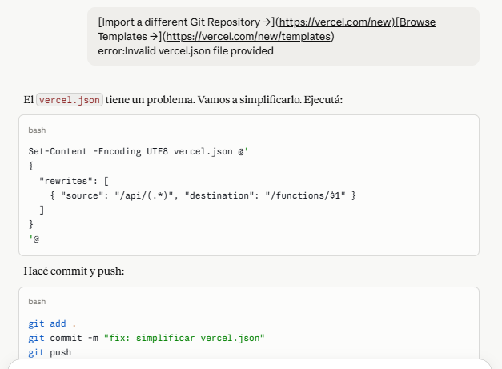
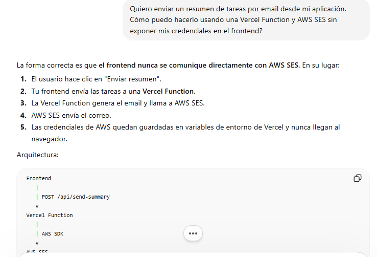
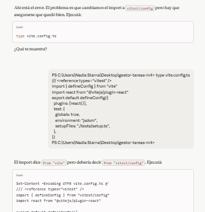

# TuAgenda - Gestor de Tareas

Aplicacion web SPA para gestion de tareas con autenticacion de usuarios, persistencia en la nube y envio de notificaciones por email. Desarrollada como proyecto integrador del Modulo 4 de MateCode.

## URL de produccion

https://gestor-tareas-m4.vercel.app

## Descripcion del proyecto

TuAgenda permite a los usuarios gestionar sus tareas diarias de forma organizada. Cada usuario tiene sus propias tareas almacenadas en la nube, puede crear, editar, eliminar y marcar tareas como completadas, filtrar por estado y prioridad, ver estadisticas en tiempo real y recibir un resumen por email.

## Stack tecnologico

- React + TypeScript + Vite
- Firebase Auth + Cloud Firestore
- AWS SES via Vercel Functions
- Vitest + React Testing Library
- Vercel

## Estructura del proyecto

gestor-tareas-m4/
- src/pages/ - Login, Register, Tasks
- src/components/ - TaskCard, TaskForm, TaskList
- src/hooks/ - useAuth, useTasks, useTheme
- src/services/ - firebase.ts
- src/routes/ - ProtectedRoute
- src/types/ - index.ts
- api/ - sendEmail.js (Vercel Function)
- tests/ - TaskForm, TaskList, TaskCard tests
- .env.example
- README.md

## Instrucciones de instalacion

1. Clonar el repositorio
git clone https://github.com/NadiaStarna/ProyectoM4-NadiaStarna.git

2. Instalar dependencias
npm install

3. Configurar variables de entorno
cp .env.example .env

4. Ejecutar en desarrollo
npm run dev

5. Ejecutar tests
npx vitest run

## Variables de entorno

VITE_FIREBASE_API_KEY=
VITE_FIREBASE_AUTH_DOMAIN=
VITE_FIREBASE_PROJECT_ID=
VITE_FIREBASE_STORAGE_BUCKET=
VITE_FIREBASE_MESSAGING_SENDER_ID=
VITE_FIREBASE_APP_ID=
AWS_ACCESS_KEY_ID=
AWS_SECRET_ACCESS_KEY=
AWS_REGION=
SES_FROM_EMAIL=

## Decisiones arquitectonicas

- Componentes organizados por capas: pages, components, hooks, services, types
- Firebase Auth con email/password y Google
- Firestore con onSnapshot para sincronizacion en tiempo real filtrada por userId
- Reglas de seguridad Firestore: cada usuario solo accede a sus propias tareas
- Vercel Functions para proteger credenciales de AWS SES
- TypeScript con tipos reutilizables definidos en src/types/index.ts
- Hooks personalizados useAuth, useTasks y useTheme para encapsular logica

## Flujo de envio de emails

1. El usuario hace clic en Enviar por email
2. El frontend llama a /api/sendEmail via POST
3. La Vercel Function recibe el request del lado del servidor
4. Usa AWS SES para enviar el email con el resumen de tareas
5. Las credenciales de AWS nunca se exponen al frontend

## Testing

- TaskForm.test.tsx - Renderizado y envio de datos
- TaskList.test.tsx - Listado y mensaje cuando no hay tareas
- TaskCard.test.tsx - Renderizado, badge, eliminacion y tarea completada

Resultado: 8 tests pasando

## Uso de inteligencia artificial en el desarrollo

Se utilizo Claude (Anthropic) como asistente durante todo el proceso de desarrollo.

### Como se integro la IA

El proceso fue colaborativo. Cada bloque de codigo fue analizado, cuestionado y adaptado. La IA fue usada como un par de programacion que explica, sugiere y corrige.

### Situaciones donde fue mas efectiva

- Configuracion de Firebase Auth y Firestore
- Implementacion de hooks personalizados con logica de tiempo real
- Configuracion del endpoint serverless para AWS SES
- Escritura de tests con Vitest y mocks
- Debugging de errores de TypeScript y CORS

### Patrones descubiertos

- Separar logica en hooks mejora reutilizacion y testing
- Variables de entorno con prefijo VITE_ para frontend, sin prefijo para servidor
- Commits semanticos frecuentes facilitan el seguimiento
- Reglas de Firestore son esenciales para seguridad por usuario
- Funciones serverless para proteger credenciales

### Evidencia del proceso

La carpeta /docs contiene capturas del proceso de trabajo con IA.

Prompt 1 - Estructura inicial del proyecto

Prompt 2 - Configuracion de Firebase

Prompt 3 - Vercel Functions y AWS SES

Prompt 4 - Testing con Vitest

